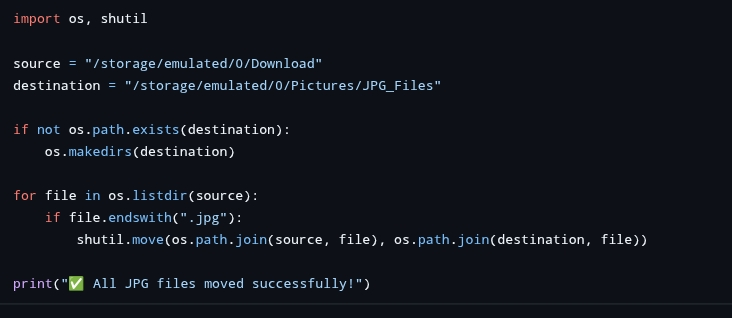
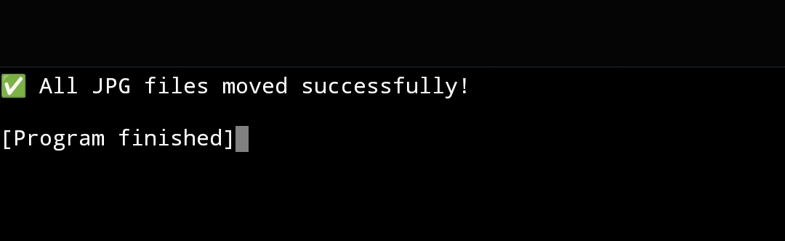

# Codealpha-task-3
Python domain 
# 🎯 CodeAlpha - Task 3 (Python Domain Internship)

This repository contains **Task 3** of my internship under the **Python Development** domain at **CodeAlpha**. This task allowed me to apply core Python concepts to solve real-world problems effectively.

---

## 📁 Repository Contents

- `Task3.py` – Source code for Task 3
- `Screenshot_2025-07-29-17-36-17.jpg` – Output Screenshot 1
- `Screenshot_2025-07-29-17-37-03.jpg` – Output Screenshot 2

---

## 📌 Task 3 Details

| Field           | Description                                                 |
|----------------|-------------------------------------------------------------|
| **Task Name**   | [Insert task title here, e.g., "Basic Quiz Application"]    |
| **Description** | [Add 1–2 lines about what this program does]                |
| **Status**      | ✅ Completed                                                |

---

## 🧰 Tech Stack

- **Language:** Python 3.x
- **IDE:** VS Code / Any Text Editor
- **Libraries/Concepts Used:** [e.g., Lists, Dictionaries, Functions, Input/Output]

---

## 📸 Screenshots

| Preview | Description |
|---------|-------------|
|  | Task Output Screenshot 1 |
|  | Task Output Screenshot 2 |

---

## 🙏 Acknowledgment

Special thanks to **CodeAlpha** for offering this hands-on internship opportunity in Python development. It helped me improve my coding skills and logical thinking.

---

## 🔗 Let's Connect

- **GitHub:** [@ARAVINDKUMARGS](https://github.com/ARAVINDKUMARGS)
- **LinkedIn:** [Aravind Kumar](https://www.linkedin.com/in/aravind-kumar)

---

> 🌟 Don’t forget to star this repository if you found it useful!
